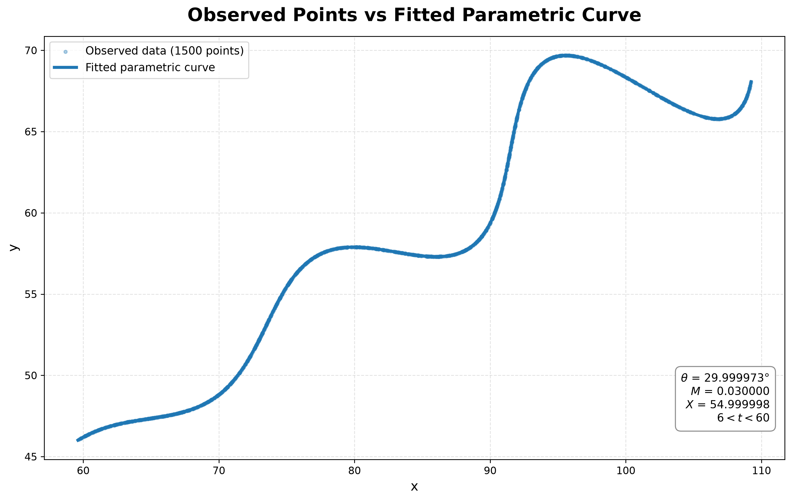

# 🎯 FlamAI R&D Assignment — Parametric Curve Fitting

**Software Engineering Intern — R&D / AI Assignment**

**Author:** Tanu Chandravanshi  
**Email:** [tanuchandravanshi9@gmail.com](mailto:tanuchandravanshi9@gmail.com)  
**GitHub:** [tanu91112](https://github.com/tanu91112)  
**Submission:** September 2026

---

# 📋 Problem Statement

The objective of this assignment is to estimate the three unknown parameters **θ (theta)**, **M**, and **X** from a set of `(x, y)` points generated by the following parametric curve.

## Equations

\[
x(t)=t\cos(\theta)-e^{M|t|}\sin(0.3t)\sin(\theta)+X
\]

\[
y(t)=42+t\sin(\theta)+e^{M|t|}\sin(0.3t)\cos(\theta)
\]

## Given Constraints

| Parameter | Range |
|---|---:|
| θ | \(0^\circ < \theta < 50^\circ\) |
| M | \(-0.05 < M < 0.05\) |
| X | \(0 < X < 100\) |
| t | \(6 < t < 60\) |

The input dataset is provided in:

```text
data/xy_data.csv
```

The goal is to recover the unknown parameters and generate a curve that closely matches the observed data.

---

# 🧠 Approach

## 1. Data Loading

The provided CSV file is loaded using Pandas.

The dataset contains:

- 1,500 data points.
- Two coordinate columns: `x` and `y`.
- No missing values in the coordinate columns.
- The original input CSV is kept unchanged in the `data/` directory.

## 2. Mathematical Transformation

Instead of directly optimizing the original equations, I simplified the problem using a coordinate transformation.

Define:

\[
x'=x-X
\]

\[
y'=y-42
\]

The curve can then be expressed as:

\[
\begin{bmatrix}
x'\\
y'
\end{bmatrix}
=
t
\begin{bmatrix}
\cos\theta\\
\sin\theta
\end{bmatrix}
+
e^{M|t|}\sin(0.3t)
\begin{bmatrix}
-\sin\theta\\
\cos\theta
\end{bmatrix}
\]

Rotating the coordinates by \(-\theta\) gives:

\[
u=(x-X)\cos\theta+(y-42)\sin\theta
\]

and

\[
v=-(x-X)\sin\theta+(y-42)\cos\theta
\]

For the correct parameters:

\[
u=t
\]

and

\[
v=e^{M|t|}\sin(0.3t)
\]

Since the given range satisfies \(t>6\):

\[
|t|=t
\]

Therefore:

\[
v=e^{Mt}\sin(0.3t)
\]

This transformation makes the relationship between the observed points and the unknown parameters easier to optimize.

---

# 🔬 Parameter Estimation

I used bounded nonlinear least squares to estimate:

\[
[\theta,M,X]
\]

subject to the parameter constraints specified in the assignment.

## Parameter Bounds

```text
theta : (0, 50) degrees
M     : (-0.05, 0.05)
X     : (0, 100)
```

The optimization is implemented using:

```python
scipy.optimize.least_squares
```

The residual function is based on the transformed relationship:

\[
r=v-e^{M|u|}\sin(0.3u)
\]

Multiple initial guesses are used to improve robustness, and the best optimization result is selected.

---

# 📊 Final Results

The optimizer recovered the following values:

| Parameter | Optimized Value | Final Rounded Value |
|---|---:|---:|
| θ | 29.9999729322° | 30° |
| M | 0.0299999969 | 0.03 |
| X | 54.9999982128 | 55 |

Therefore, the final estimated parameters are:

\[
\boxed{\theta=30^\circ}
\]

\[
\boxed{M=0.03}
\]

\[
\boxed{X=55}
\]

The optimized values are effectively equal to these clean values.

---

# 📏 Validation

The fitted parameters were validated by generating the predicted curve over the specified parameter range and comparing it with the observed data.

## Optimization Results

```text
Optimization cost      = 9.114989679543e-09
Function evaluations   = 8
```

## L1 Validation

```text
Mean L1 distance       = 2.339562110304e-04
Total L1 distance      = 3.509343165456e-01
```

The very small optimization residual indicates that the recovered parameters closely reproduce the supplied curve.

## Validation Method

The CSV contains only `x` and `y` coordinates and does not explicitly provide the corresponding `t` values.

Therefore, the validation process:

1. Recovers the corresponding parameter coordinate using the fitted transformation.
2. Sorts the observed points by the recovered `t`.
3. Uniformly samples the parameter range.
4. Interpolates the observed curve at those uniformly sampled points.
5. Computes the L1 distance between the observed and predicted coordinates.

---

# 📝 Final Answer

The unknown parameters are:

\[
\boxed{\theta=30^\circ,\quad M=0.03,\quad X=55}
\]

Substituting these values into the original equations gives:

\[
\boxed{
x(t)=t\cos(30^\circ)-e^{0.03|t|}\sin(0.3t)\sin(30^\circ)+55
}
\]

\[
\boxed{
y(t)=42+t\sin(30^\circ)+e^{0.03|t|}\sin(0.3t)\cos(30^\circ)
}
\]

where:

\[
\boxed{6<t<60}
\]

---

# 📐 Desmos Format

The fitted curve can be visualized in Desmos using:

```text
(
  t*cos(30°)-e^(0.03*abs(t))*sin(0.3*t)*sin(30°)+55,
  42+t*sin(30°)+e^(0.03*abs(t))*sin(0.3*t)*cos(30°)
)
```

Set the parameter restriction as:

```text
6 < t < 60
```

---

# 🖼️ Visual Result



The fitted curve closely overlaps the observed data points, providing a visual confirmation of the numerical fit.

The plot also displays the estimated parameter values used to generate the fitted curve.

---

# 💻 How to Run

## Prerequisites

Python 3.9+ is recommended.

Install the required dependencies:

```bash
pip install -r requirements.txt
```

## Run the Complete Solution

From the repository root:

```bash
python code/main.py
```

On Windows, the following also works:

```bash
py code/main.py
```

The program will:

- Load the input CSV.
- Estimate θ, M, and X.
- Perform uniform-parameter L1 validation.
- Generate the fitted curve visualization.
- Save the optimization results.
- Save the predicted curve data.

---

# 📁 Repository Structure

```text
FlamAI_RND_Assignment_TanuChandravanshi/
│
├── README.md
├── requirements.txt
├── .gitignore
│
├── code/
│   ├── main.py
│   ├── optimization.py
│   └── utils.py
│
├── data/
│   └── xy_data.csv
│
└── outputs/
    ├── fitted_curve.png
    ├── comparison.csv
    └── optimization_results.txt
```

## File Description

| File | Description |
|---|---|
| `README.md` | Problem statement, mathematical derivation, methodology, and results |
| `requirements.txt` | Python dependencies |
| `.gitignore` | Files excluded from version control |
| `code/main.py` | Main execution, validation, and output generation |
| `code/optimization.py` | Parameter optimization implementation |
| `code/utils.py` | Curve generation, data loading, and coordinate transformation |
| `data/xy_data.csv` | Original assignment dataset |
| `outputs/fitted_curve.png` | Observed points versus fitted curve |
| `outputs/comparison.csv` | Uniformly sampled predicted curve |
| `outputs/optimization_results.txt` | Optimization and validation results |

---

# 🛠️ Technologies Used

- Python
- NumPy
- Pandas
- SciPy
- Matplotlib
- Nonlinear Least Squares
- Numerical Optimization

---

# 🔎 Reproducibility

The final parameter values are not hard-coded into the optimization process.

The program independently:

1. Loads the supplied dataset.
2. Applies the mathematical coordinate transformation.
3. Uses the parameter bounds specified in the assignment.
4. Optimizes θ, M, and X.
5. Selects the best result from multiple initial guesses.
6. Performs L1 validation.
7. Generates the fitted curve and result files.

This makes the solution reproducible from the supplied input data.

---

# ⭐ Key Mathematical Insight

The main insight in this solution is that the original parametric equations contain two perpendicular components:

\[
t
\begin{bmatrix}
\cos\theta\\
\sin\theta
\end{bmatrix}
\]

and

\[
e^{M|t|}\sin(0.3t)
\begin{bmatrix}
-\sin\theta\\
\cos\theta
\end{bmatrix}
\]

By translating and rotating the observed points, the first component becomes the parameter itself:

\[
u=t
\]

while the second component becomes:

\[
v=e^{Mt}\sin(0.3t)
\]

for \(t>6\).

This reduces the original curve-fitting problem to a simpler relationship and provides a mathematically interpretable way to estimate the unknown parameters.

---

# 🎯 Why This Approach

The solution focuses on three aspects:

## 1. Mathematical Understanding

The coordinate transformation exploits the structure of the given equations rather than treating the problem as a purely black-box optimization problem.

## 2. Constrained Optimization

The optimizer respects the parameter ranges provided in the assignment.

## 3. Numerical and Visual Validation

The solution validates the fitted parameters using L1 distance and also generates a visualization comparing the observed and fitted curves.

---

# ✅ Conclusion

The parametric curve was successfully fitted to the supplied dataset.

The recovered parameters are:

\[
\boxed{\theta=30^\circ,\quad M=0.03,\quad X=55}
\]

The optimization achieved a cost of approximately:

\[
\boxed{9.11\times10^{-9}}
\]

with only 8 function evaluations.

The fitted curve closely matches the supplied data, and the complete implementation, original input data, validation results, predicted curve data, and visualization are included in this repository.

---

# 👤 Author

**Tanu Chandravanshi**

📧 Email: [tanuchandravanshi9@gmail.com](mailto:tanuchandravanshi9@gmail.com)

🐙 GitHub: [github.com/tanu91112](https://github.com/tanu91112)

---

# 📅 Submission

**September 2026**

**FlamAI R&D Assignment — Software Engineering Intern**